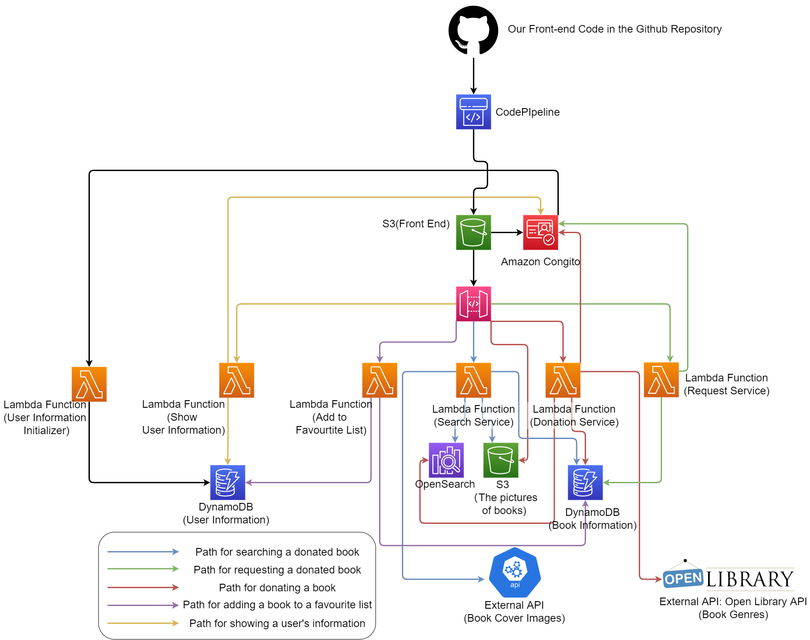

# BookExchange
## Tianhang Cui(tc3158), Zhenrui Chen(zc2569), Anni Chen(ac4779), Dantong Zhu(dz2451)

### General Idea:
Current days, books are really expensive for lots of reasons, including the rising cost of printing on paper, royalties, the economy of scale, return policy, and transit costs. Therefore more people prefer to have cheap, used books rather than the new paper books, this is especially the case for students' textbooks.

As there are some people who do not really need their books after reading but some people are seeking to buy these books. We can see there is a need for a platform for people to effectively exchange their books with each other.

Therefore we intended to build Book-Exchange -- a second-book exchange platform that satisfied people's need to exchange books easily, and we currently put the focus on the students at Columbia University. We made such a decision not only because there are many students who have the passion and time to read a lot of books, but also because there is a huge need for getting new textbooks and giving away old textbooks every semester.

We want to make it a place where every user can easily find the books they need and have the motivation to donate their books to others. Donating and requesting books is the main part of our application, and we want to create an environment for sharing thoughts and making friends with other readers who share the same interests.

### Structure:

### Motivation:

People often need to buy some books either for their study or interest, but the price to buy a new book is usually high. In the meantime, there are a lot of people who have finished their use of the books and they are happy to donate them to others. There is a need to make donators and those who need the books get in contact with each other.

### Functions:

Our application includes the following functions.

- Allows user to create an account and login, to make each user is distinguishable.
- Allows user to search for available books based on keywords, genres and book-condition, order them by alphabetical or other orders.
- Allows users to request donated books

- Make a currency-like thing named “credit”, to avoid malicious request for books and encourage users to donate their books.

- Allows users send message to donators for information about their second-hand books, or contact others who share the same interest.

- Allows the user to add a book to their favourite list for easy-search.

- Ability to make a donation by just entering a few details

- Notifications sent to the user about their donation or other messages via text and email

- Allows donators to post information about books including pricing power and interested users can make requests and get books from donators.

- Allows transactions using credits instead of real money, which encourage more donations mean more ability to request books.

- Allow interactions between users like message sending so that users with similar reading interests can freely talk to each other. 

### Existing Similar Work 
After industry research, We did not find any existing applications that would provide all the services stated above. Indeed there are some online second-hand bookstores, but our platform aims to provide services between a reader to another reader directly without any payment, it is more like encouraging using books to exchange books with others.

### Data/API

OpenLibrary API:
https://openlibrary.org/developers/api